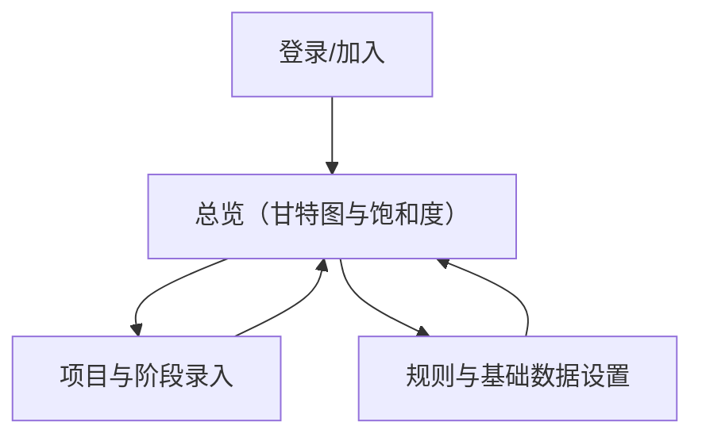

## 1. Product Overview
面向 Mac 端的人力管理应用，用于录入项目工作量与交付日期，并通过甘特图查看个人与业务方向的占用与饱和度。
支持按“项目阶段”配置投入计算规则，统一口径生成投入统计与饱和度。

## 2. Core Features

### 2.1 User Roles
| 角色 | 注册/加入方式 | 核心权限 |
|------|----------------|----------|
| 成员 | 管理员邀请加入（邮箱） | 录入/编辑自己参与的项目阶段投入；查看自己的甘特图与饱和度 |
| 管理员 | 初始管理员或被授予 | 管理成员与业务方向；创建/维护项目；配置阶段投入规则；查看全局与按业务方向的饱和度 |

### 2.2 Feature Module
本产品由以下主要页面构成：
1. **登录/加入**：邮箱登录、接受邀请加入、退出登录。
2. **总览（甘特图与饱和度）**：按人/按业务方向切换；甘特图时间轴；占用与饱和度指标。
3. **项目与阶段录入**：项目基本信息（交付日期）；阶段划分；成员投入录入；项目列表与搜索。
4. **规则与基础数据设置**：阶段投入规则配置；业务方向维护；成员与权限管理。

### 2.3 Page Details
| Page Name | Module Name | Feature description |
|-----------|-------------|---------------------|
| 登录/加入 | 邮箱认证 | 使用邮箱登录；通过邀请完成加入；保持会话与退出登录 |
| 总览（甘特图与饱和度） | 视图切换 | 在“个人/业务方向”视图间切换；按日期范围筛选（周/月/自定义） |
| 总览（甘特图与饱和度） | 甘特图 | 展示项目阶段在时间轴上的分布；支持展开/折叠项目与阶段；悬停查看阶段投入与交付日期 |
| 总览（甘特图与饱和度） | 占用与饱和度 | 基于阶段投入与规则计算占用（人天/小时）与饱和度（%）；展示总计与分段汇总 |
| 项目与阶段录入 | 项目管理 | 新建/编辑项目名称、业务方向、交付日期；查看项目列表；按名称/业务方向筛选 |
| 项目与阶段录入 | 阶段管理 | 为项目维护阶段（名称、开始/结束日期、阶段类型）；阶段与交付日期的校验与提示 |
| 项目与阶段录入 | 投入录入 | 为阶段录入成员投入（计划/实际其一或两者）；支持批量录入与快速复制上一周期 |
| 规则与基础数据设置 | 阶段投入规则 | 配置“按阶段类型/阶段占比/固定系数”等规则；保存后用于统一计算口径 |
| 规则与基础数据设置 | 业务方向与成员 | 维护业务方向；邀请成员、设置管理员权限、停用成员 |

## 3. Core Process
- 成员流：登录/加入 → 在“项目与阶段录入”找到自己参与的项目 → 录入项目阶段的计划/实际投入 → 回到“总览”在个人视图查看甘特图与饱和度。
- 管理员流：登录 → 维护业务方向与成员 → 创建项目并录入交付日期与阶段 → 配置阶段投入规则 → 在“总览”按业务方向查看占用与饱和度，并根据结果调整项目与阶段投入。

