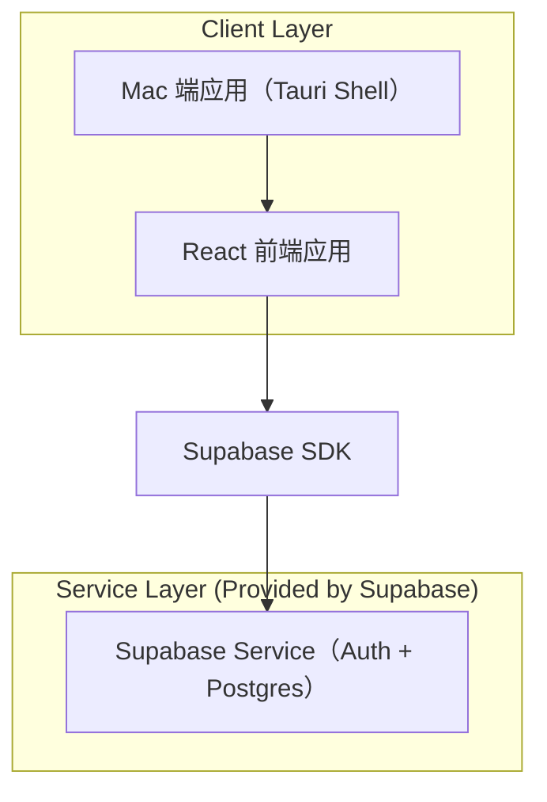
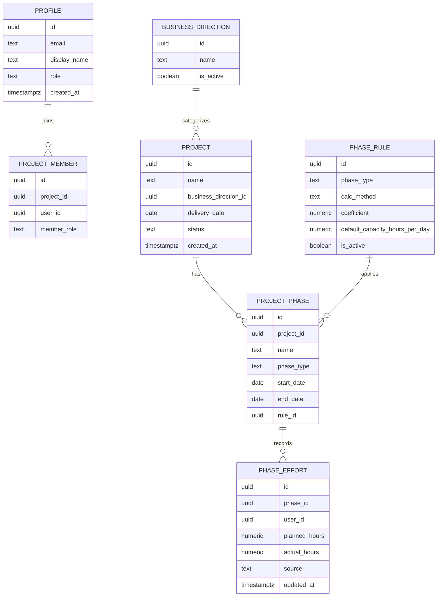

## 1.Architecture design


## 2.Technology Description
- 客户端（Mac 桌面）：Tauri + React@18 + TypeScript + vite
- UI：tailwindcss@3（桌面优先）
- Backend：None（直接使用 Supabase）
- BaaS：Supabase（Auth、PostgreSQL）

## 3.Route definitions
| Route | Purpose |
|-------|---------|
| /login | 邮箱登录/邀请加入 |
| /overview | 甘特图与饱和度总览（个人/业务方向切换） |
| /projects | 项目列表、项目详情、阶段与投入录入 |
| /settings | 阶段投入规则、业务方向、成员与权限 |

## 6.Data model(if applicable)

### 6.1 Data model definition


### 6.2 Data Definition Language
> 说明：不使用物理外键约束，仅保留逻辑外键字段；建议对所有业务表开启 RLS，仅允许 authenticated 访问自己的数据或管理员访问全量。

```sql
-- profiles（映射 auth.users）
CREATE TABLE profiles (
  id uuid PRIMARY KEY,
  email text NOT NULL,
  display_name text,
  role text NOT NULL DEFAULT 'member',
  created_at timestamptz NOT NULL DEFAULT now()
);

CREATE TABLE business_directions (
  id uuid PRIMARY KEY DEFAULT gen_random_uuid(),
  name text NOT NULL,
  is_active boolean NOT NULL DEFAULT true
);

CREATE TABLE projects (
  id uuid PRIMARY KEY DEFAULT gen_random_uuid(),
  name text NOT NULL,
  business_direction_id uuid,
  delivery_date date,
  status text NOT NULL DEFAULT 'active',
  created_at timestamptz NOT NULL DEFAULT now()
);
CREATE INDEX idx_projects_business_direction_id ON projects(business_direction_id);
CREATE INDEX idx_projects_delivery_date ON projects(delivery_date);

CREATE TABLE project_members (
  id uuid PRIMARY KEY DEFAULT gen_random_uuid(),
  project_id uuid NOT NULL,
  user_id uuid NOT NULL,
  member_role text NOT NULL DEFAULT 'contributor'
);
CREATE INDEX idx_project_members_project_id ON project_members(project_id);
CREATE INDEX idx_project_members_user_id ON project_members(user_id);

CREATE TABLE phase_rules (
  id uuid PRIMARY KEY DEFAULT gen_random_uuid(),
  phase_type text NOT NULL,
  calc_method text NOT NULL, -- e.g. 'fixed_coefficient' | 'by_ratio'
  coefficient numeric NOT NULL DEFAULT 1,
  default_capacity_hours_per_day numeric NOT NULL DEFAULT 8,
  is_active boolean NOT NULL DEFAULT true
);
CREATE INDEX idx_phase_rules_phase_type ON phase_rules(phase_type);

CREATE TABLE project_phases (
  id uuid PRIMARY KEY DEFAULT gen_random_uuid(),
  project_id uuid NOT NULL,
  name text NOT NULL,
  phase_type text NOT NULL,
  start_date date,
  end_date date,
  rule_id uuid
);
CREATE INDEX idx_project_phases_project_id ON project_phases(project_id);
CREATE INDEX idx_project_phases_date ON project_phases(start_date, end_date);

CREATE TABLE phase_efforts (
  id uuid PRIMARY KEY DEFAULT gen_random_uuid(),
  phase_id uuid NOT NULL,
  user_id uuid NOT NULL,
  planned_hours numeric,
  actual_hours numeric,
  source text NOT NULL DEFAULT 'manual',
  updated_at timestamptz NOT NULL DEFAULT now()
);
CREATE INDEX idx_phase_efforts_phase_id ON phase_efforts(phase_id);
CREATE INDEX idx_phase_efforts_user_id ON phase_efforts(user_id);

-- Grants（按需收紧 anon；核心业务表建议仅 authenticated）
GRANT ALL PRIVILEGES ON profiles, business_directions, projects, project_members, phase_rules, project_phases, phase_efforts TO authenticated;
```
